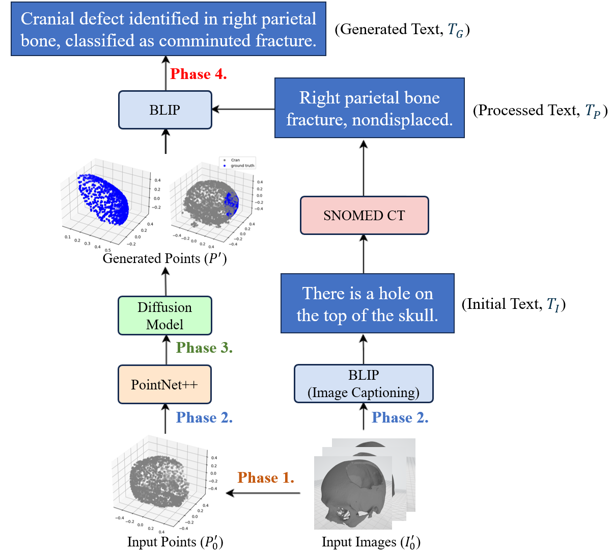
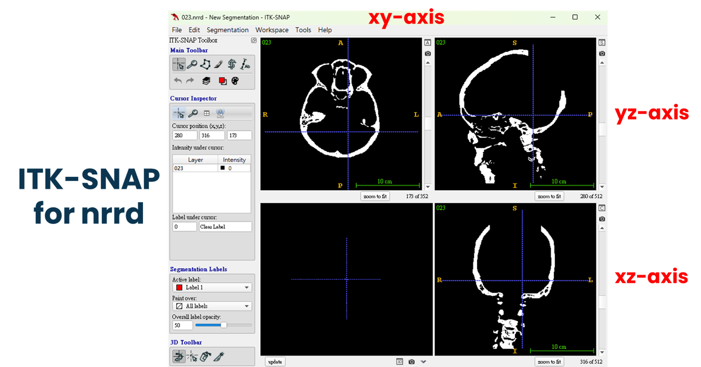
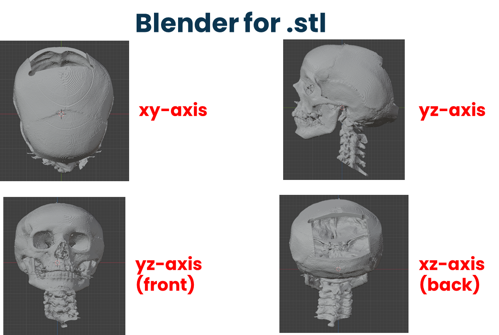
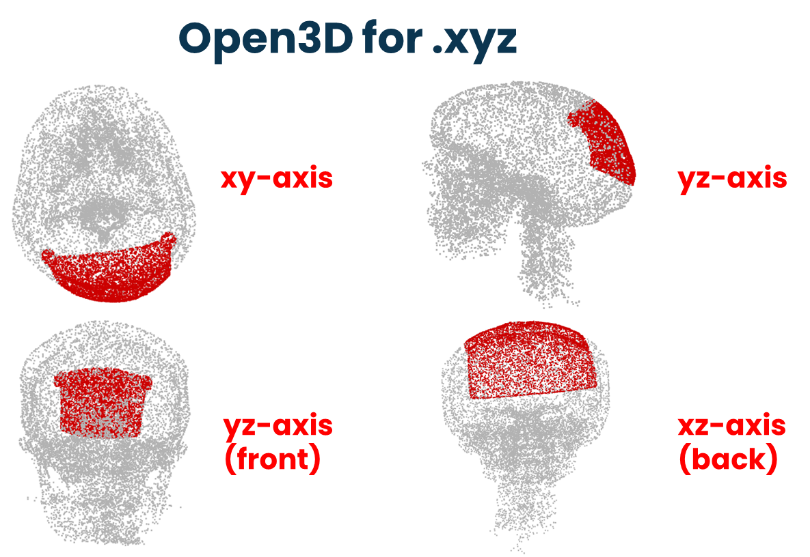
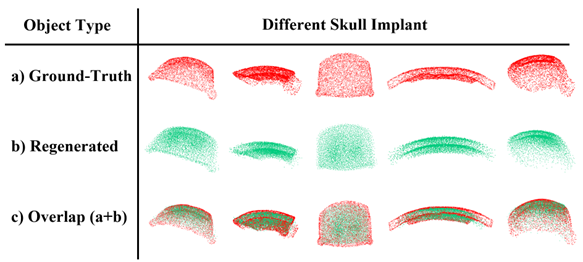
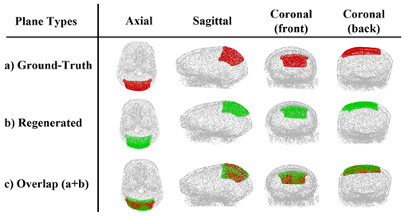

> [!WARNING]
> - Please view this repository in ***"bright appearance"*** mode to ensure optimal readability of all content.
> - This Git repository is for reference only. **No license granted for any usage or redistribution.**

# CTDM-Cranioplasty-Framework
Cranioplasty Transformer Diffusion Model (CTDM) — A multimodal clinical system based on Transformer and Diffusion Models for generating cranial defect reconstruction point clouds and diagnostic text.

---

## Overview
With the rapid success of the **Transformer** framework, multimodal learning has become a critical technology driving intelligent medical imaging analysis and clinical decision support. Cranioplasty, a core neurosurgical procedure, requires highly accurate planning and implant design for cranial reconstruction. However, existing approaches face several challenges in **point cloud reconstruction** and **clinical text generation**, such as semantic misalignment, geometric deficiencies, and suboptimal multimodal representation learning.  

To address these challenges, we propose the **Cranioplasty Transformer Diffusion Model (CTDM)**, an innovative framework integrating Transformer-based architectures and Diffusion Models for precise cranial defect reconstruction and clinically relevant diagnostic text generation.

--- 

## Framework  


---

## Key Module
- **Image Feature Extraction:** The current implementation focuses on medical imaging data as the primary modality. A tailored **autoencoder backbone** is used to embed images into a compact latent space that preserves structural fidelity.
- **PointCloudAutoencoder (adapted for imaging):** Serves as the latent-space encoder–decoder, enabling the mapping of medical images into structured latent representations and reconstruction-ready outputs.
- **Diffusion 3D UNet:** An enhanced UNet with residual and attention layers, operating in latent space. It learns image-conditioned denoising steps for improved generation quality and structural consistency.
- **Conditional Encoding:** Image-derived embeddings serve as conditions injected into the diffusion process, ensuring clinically consistent reconstructions.
- **Latent Diffusion Model (LDM):** Provides high-quality image reconstruction and enables scalable generative training in compressed latent space, reducing computational cost while preserving detail.
- **Self-Attention and Transformer Blocks:** Incorporated into the encoder–decoder pipeline, these modules improve long-range dependencies and enhance image feature integration.
- **Multimodal Learning:** Integration of 3D point clouds, medical images, and clinical text.
- **SNOMED CT Vocabulary:** Guarantees medical domain relevance and standardized terminology for downstream training.  
- **BLIP (Bootstrapping Language-Image Pre-training):** Improves cross-modal alignment between images and language. 
- **Point-Grounded Text Encoder & Decoder:** Facilitates tight coupling between spatial geometry and clinical linguistic representation.  

---

## Sample Images
nrrd image:  


stl image:  


xyz image:  


---

## Performance
Expected Outcomes:
```bash
- High-precision cranial reconstruction with improved geometric and textural fidelity.  
- Automatic generation of standardized, clinically valuable diagnostic text.  
- Reduced burden on medical professionals with accelerated preoperative planning.  
- Enhanced decision-making accuracy for cranioplasty procedures.  
```
Pretrained AutoEncoder Output:

Diffusion Model Output:


---
